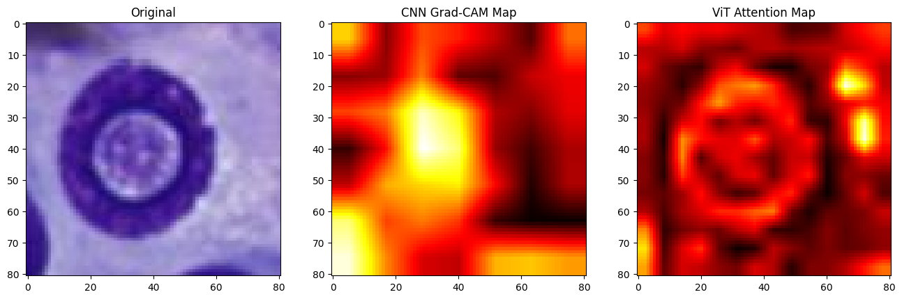
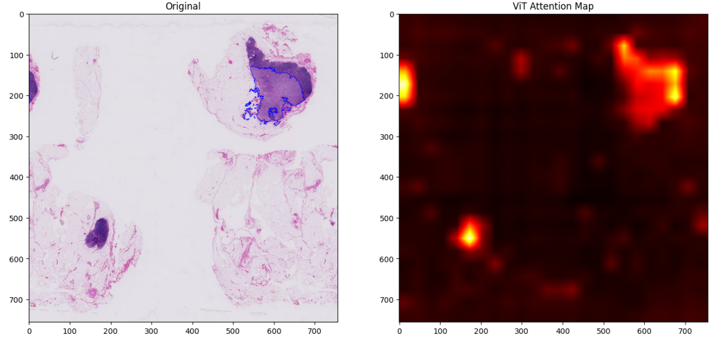
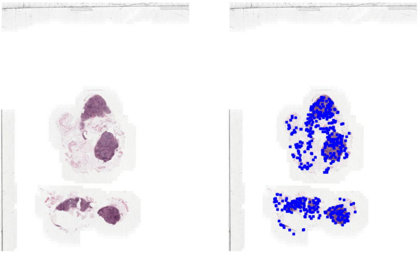

# Benchmarking Vision Transformers for Image Classification in Digital Pathology
- University of Namur
- June 2023
- https://researchportal.unamur.be/en/studentTheses/benchmarking-vision-transformers-for-image-classification-in-digi

This repository contains the code developed during my master thesis. We explore the application of Vision Transformers (ViTs) in the field of digital pathology.

## Abstract
Experts in digital pathology use artificial intelligence to help them detect disease in images of biological tissue. Convolutional Neural Networks (CNNs) are commonly used for this purpose. In this master thesis, we evaluate a new architecture, Vision Transformer (ViT), by comparing them with CNNs. ViTs have recently appeared in image recognition and have shown promising results. We test their applicability in digital pathology by empirically comparing the two models on a diverse set of biomedical images. The results indicate that both models achieve similar performances, suggesting that they can both be considered as potential choices for disease detection. These findings underline the interest in further exploring the use of ViTs in digital pathology.

## Key Features
- **Fine-tuning** pretrained models with *pytorch-lightning*, *timm* and *transformers*.
- Visualisation of **attention maps** computed by Vision Transformers with comparison with CNNs vision (Grad-CAM).

- Implementation of **Multiple Instance Learning** to classify Whole-Slides Images (WSIs preprocessing, training and testing).

## Acknowledgments
For visualisation:
- https://github.com/novice03/timm-vis/blob/main/timm_vis/methods.py
- https://github.com/jeonsworld/ViT-pytorch
- https://github.com/huggingface/pytorch-image-models/discussions/1232

For Multiple Instance Learning: 
- https://github.com/MSKCC-Computational-Pathology/MIL-nature-medicine-2019
